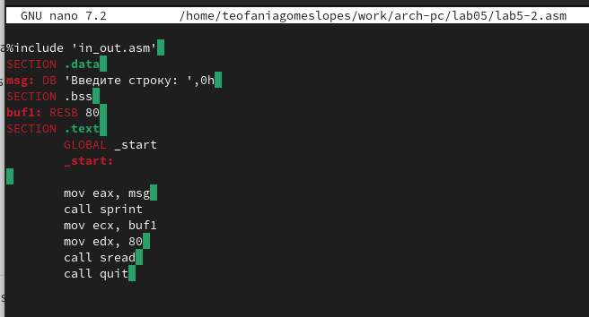

---
## Front matter
title: "Шаблон отчёта по лабораторной работе"
subtitle: "Простейший вариант"
author: "Гомес Лопес Теофания"

## Generic otions
lang: ru-RU
toc-title: "Содержание"

## Bibliography
bibliography: bib/cite.bib
csl: pandoc/csl/gost-r-7-0-5-2008-numeric.csl

## Pdf output format
toc: true # Table of contents
toc-depth: 2
lof: true # List of figures
lot: true # List of tables
fontsize: 12pt
linestretch: 1.5
papersize: a4
documentclass: scrreprt
## I18n polyglossia
polyglossia-lang:
  name: russian
  options:
	- spelling=modern
	- babelshorthands=true
polyglossia-otherlangs:
  name: english
## I18n babel
babel-lang: russian
babel-otherlangs: english
## Fonts
mainfont: IBM Plex Serif
romanfont: IBM Plex Serif
sansfont: IBM Plex Sans
monofont: IBM Plex Mono
mathfont: STIX Two Math
mainfontoptions: Ligatures=Common,Ligatures=TeX,Scale=0.94
romanfontoptions: Ligatures=Common,Ligatures=TeX,Scale=0.94
sansfontoptions: Ligatures=Common,Ligatures=TeX,Scale=MatchLowercase,Scale=0.94
monofontoptions: Scale=MatchLowercase,Scale=0.94,FakeStretch=0.9
mathfontoptions:
## Biblatex
biblatex: true
biblio-style: "gost-numeric"
biblatexoptions:
  - parentracker=true
  - backend=biber
  - hyperref=auto
  - language=auto
  - autolang=other*
  - citestyle=gost-numeric
## Pandoc-crossref LaTeX customization
figureTitle: "Рис."
tableTitle: "Таблица"
listingTitle: "Листинг"
lofTitle: "Список иллюстраций"
lotTitle: "Список таблиц"
lolTitle: "Листинги"
## Misc options
indent: true
header-includes:
  - \usepackage{indentfirst}
  - \usepackage{float} # keep figures where there are in the text
  - \floatplacement{figure}{H} # keep figures where there are in the text
---

# Цель работы
Мы научимся использовать "Midnight commender" и освоим инструкции mov и int языка ассемблера.

# Выполнение лабораторной работы

1.На этом мы запустили mc(рис. [-@fig:001]).

{#fig:001 width=70%}

2.После этого мы переместились в каталог ~/work/arch-pc. (рис. [-@fig:002]).

{#fig:002 width=70%}

3.После этого и с помощью клавиши f7 мы создали новую папку lab05. (рис. [-@fig:003]).

{#fig:003 width=70%}

4.Используя строку ввода и сенсорную команду, мы создали файл lab5-1.asm. (рис. [-@fig:004]).

{#fig:004 width=70%}

5.Используя функциональную клавишу F4, мы открыли файл lab5-1.asm. (рис. [-@fig:004]).

{#fig:005 width=70%}

6.Мы скопировали текст программы из листинга 5.1 в файл asm, затем сохранили и закрыли файл. (рис. [-@fig:006]).

{#fig:006 width=70%}

7.Используя функциональную клавишу F3, мы открыли файл lab5-1.asm для просмотра. И мы проверили, что файл содержит текст программы. (рис. [-@fig:007]).

{#fig:007 width=70%}

8.Затем мы перевели текст программы lab5-1.asm в объектный файл. Выполнил разметку объектного файла и запустил полученный исполняемый файл, где программа выводит 'Введите строку:' и ожидает ввода с клавиатуры. По запросу, в этот момент мы ввели наше имя и фамилию. (рис. [-@fig:008]).

{#fig:008 width=70%}

9.После этого мы загрузили файл in_out.asm из ТУИСА и с помощью mc мы смогли переместить файл в правильный каталог. (рис. [-@fig:009]).

{#fig:009 width=70%}

10.Используя функциональную клавишу F5, мы создали копию файла lab5-1.asm с именем lab6-2.asm. (рис. [-@fig:010]).

{#fig:010 width=70%}

11.После этого мы испрпвляем текст программы в файле lab5-2.asm, используя подпрограммы из внешнего файла in_out.asm. (рис. [-@fig:011]).

{#fig:011 width=70%}

12.Затем мы перевели текст программы lab5-2.asm в объектный файл. Выполнил разметку объектного файла и запустили полученный исполняемый файл. (рис. [-@fig:012]).

{#fig:012 width=70%}

13.На этом шаге мы меняем функцию sprintLF на функцию sprint Создал
исполняемый файл, и разница заключалась в том, что эта функция изменяет
входные данные на новую строку. (рис. [-@fig:013]).

{#fig:013 width=70%}

14.(рис. [-@fig:014])

{#fig:014 width=70%}

2.1 Выводы по результатам выполнения заданий :
• В ходе лабораторных работ мы узнали, как использовать midnight
commander, и мы овладели навыками использования инструмента nasm.

3 Задание для самостоятельной работы :

.1 Создание программы без использования внешнего
файла :
• В этой части мы должны были сделать копию файла lab6-1.asm, а затем мы
должны были создать программу, которая запрашивает ввод строки, затем
позволяет выполнить ввод с клавиатуры и, наконец, отобразить введенную
строку, но без использования внешнего файла in_out.асм. (рис. 3.1) (рис.
3.2)

(рис. [-@fig:015])

{#fig:015 width=70%}

(рис. [-@fig:016])

{#fig:016 width=70%}

3.2 создание программы с использованием внешнего
файла:
• в этой части мы попытались выполнить ту же программу, но с использова-
нием внешнего файла.

(рис. [-@fig:017])

{#fig:017 width=70%}

(рис. [-@fig:018])

{#fig:018 width=70%}

3.3 Выводы по результатам выполнения заданий :
В этой части мы узнали, как создавать и редактировать программы с помощью
подпрограмм и как управлять с помощью языка ассемблера.

# Выводы

Выводы, согласованные с целью
работы :
• На шестой лабораторной работе мы научимся использовать “Midnight
commander” и освоим инструкции mov и int языка ассемблера и мы узнали,
как создавать и редактировать программы с помощью подпрограмм и как
управлять с помощью языка ассемблера

# Список литературы{.unnumbered}

::: {#refs}
:::
