---
## Front matter
title: "Шаблон отчёта по лабораторной работе №7"
subtitle: "Команды безусловного и условного переходов в Nasm. Программирование ветвлений."
author: "Гомес Лопес Теофания"

## Generic otions
lang: ru-RU
toc-title: "Содержание"

## Bibliography
bibliography: bib/cite.bib
csl: pandoc/csl/gost-r-7-0-5-2008-numeric.csl

## Pdf output format
toc: true # Table of contents
toc-depth: 2
lof: true # List of figures
lot: true # List of tables
fontsize: 12pt
linestretch: 1.5
papersize: a4
documentclass: scrreprt
## I18n polyglossia
polyglossia-lang:
  name: russian
  options:
	- spelling=modern
	- babelshorthands=true
polyglossia-otherlangs:
  name: english
## I18n babel
babel-lang: russian
babel-otherlangs: english
## Fonts
mainfont: IBM Plex Serif
romanfont: IBM Plex Serif
sansfont: IBM Plex Sans
monofont: IBM Plex Mono
mathfont: STIX Two Math
mainfontoptions: Ligatures=Common,Ligatures=TeX,Scale=0.94
romanfontoptions: Ligatures=Common,Ligatures=TeX,Scale=0.94
sansfontoptions: Ligatures=Common,Ligatures=TeX,Scale=MatchLowercase,Scale=0.94
monofontoptions: Scale=MatchLowercase,Scale=0.94,FakeStretch=0.9
mathfontoptions:
## Biblatex
biblatex: true
biblio-style: "gost-numeric"
biblatexoptions:
  - parentracker=true
  - backend=biber
  - hyperref=auto
  - language=auto
  - autolang=other*
  - citestyle=gost-numeric
## Pandoc-crossref LaTeX customization
figureTitle: "Рис."
tableTitle: "Таблица"
listingTitle: "Листинг"
lofTitle: "Список иллюстраций"
lotTitle: "Список таблиц"
lolTitle: "Листинги"
## Misc options
indent: true
header-includes:
  - \usepackage{indentfirst}
  - \usepackage{float} # keep figures where there are in the text
  - \floatplacement{figure}{H} # keep figures where there are in the text
---

# Цель работы
Освоить условного и безусловного перехода. Ознакомиться с назначением и структурой файла листинга.

# Задание

Написать программы для решения системы выражений.

# Выполнение лабораторной работы

## Реализация переходов в NASM

 Создала каталог для программ ЛБ7, и в нем создала файл (рис. [-@fig:001]).

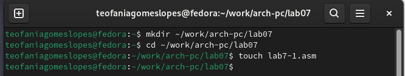{#fig:001 width=70%}

Открывала файл в Midnight Commander и заполняла его в соответствии с листингом 7.1 (рис. [-@fig:002]).

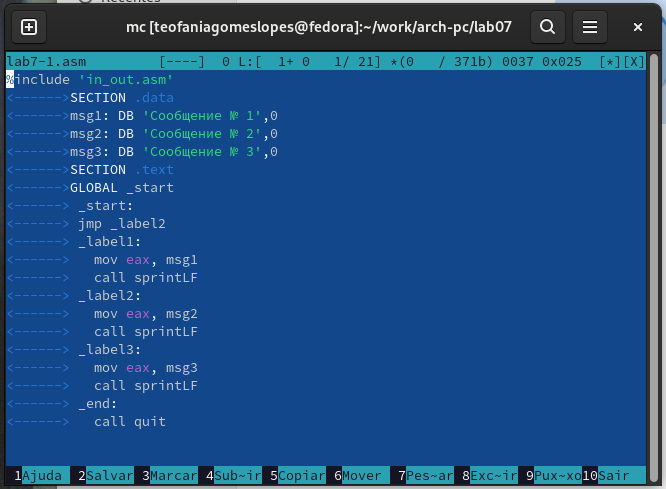{#fig:002 width=70%}

Создала исполняемый файл и запускаем его (рис. [-@fig:003]).

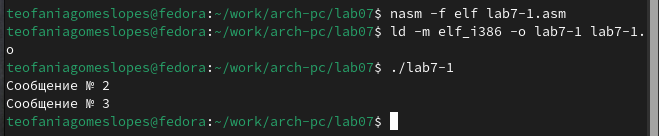{#fig:003 width=70%}

Снова открывала файл для редактирования и изменяла его, чтобы произошел данный вывод (рис. [-@fig:004]).

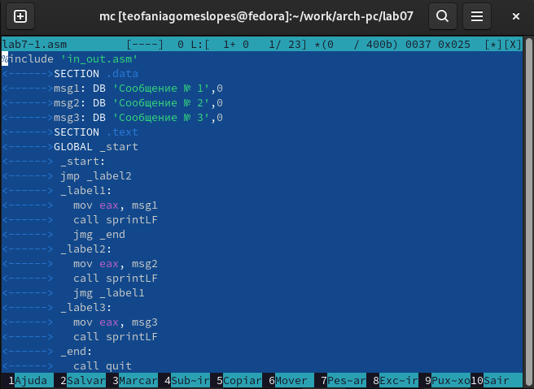{#fig:004 width=70%}

Создала исполняемый файл и запускала его (рис. [-@fig:005]).

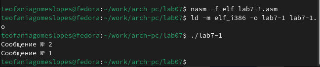{#fig:005 width=70%}

Снова открывала файл для редактирования и изменяла его, чтобы произошел данный вывод (рис. [-@fig:006]).

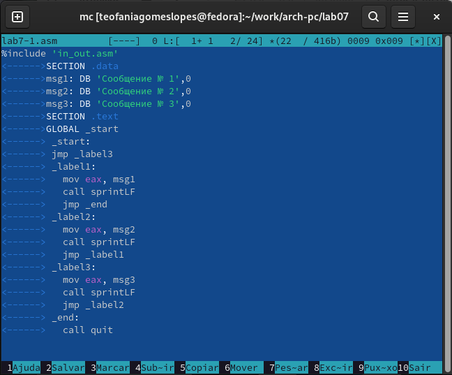{#fig:006 width=70%}

Создала исполняемый файл и запускала его (рис. [-@fig:007]).

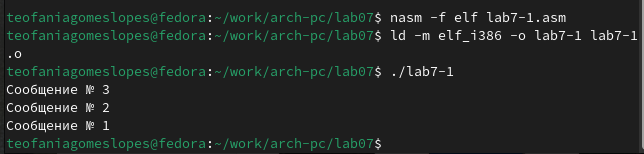{#fig:007 width=70%}

Создала новый файл (рис. [-@fig:008]).

{#fig:008 width=70%}

Открывала файл в Midnight Commander и заполняла его в соответствии с листингом 7.3 (рис. [-@fig:009]).

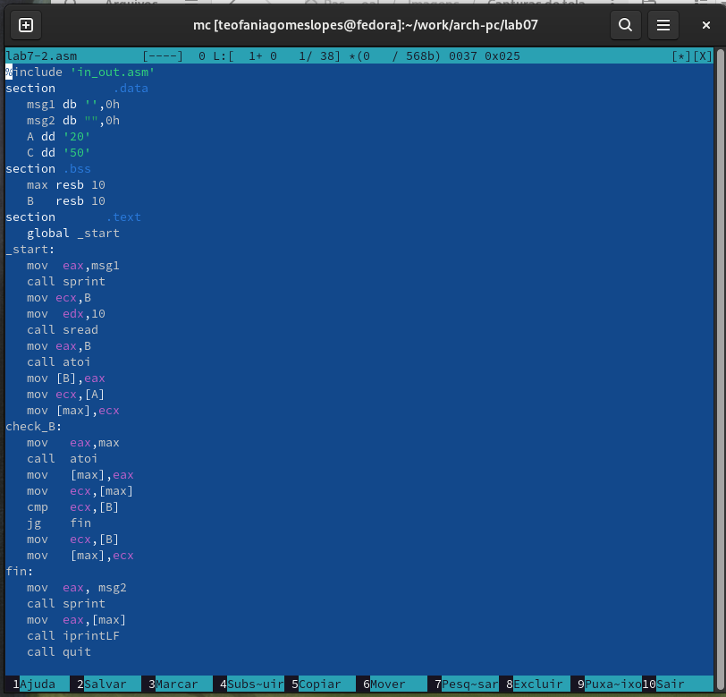{#fig:009 width=70%}

Создала исполняемый файл и проверяла его работу, вводя разные значения (рис. [-@fig:010]).

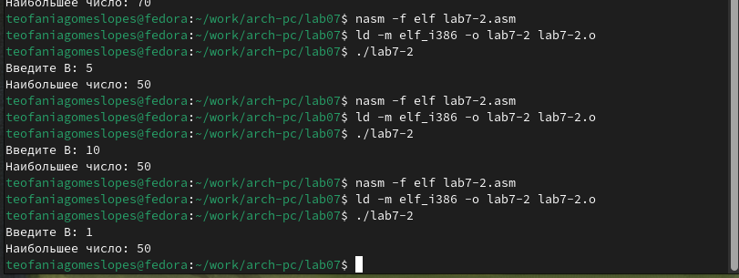{#fig:010 width=70%}

## Изучение структуры файлы листинга

Создала файл листинга дла программы lab7-2.asm (рис. [-@fig:011]).

{#fig:011 width=70%}

Открывала файл листинга с помощью команды mcedit и изучала его (рис. [-@fig:012]).

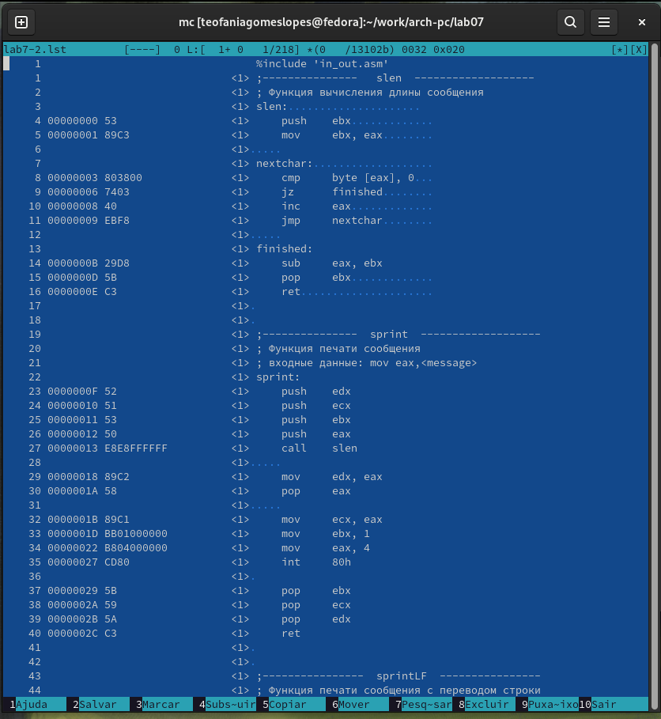{#fig:012 width=70%}

Строка 33: 0000001D-адрес в сегменте кода, BB01000000-машинный код, mov ebx,1-присвоение переменной ecx значения 1.

Строка 34: 00000022-адрес в сегменте кода, B804000000-машинный код, mov eax,4-присвоение переменной eax значения 4.

Открывала файл и удаляла один операндум (рис. [-@fig:013]).

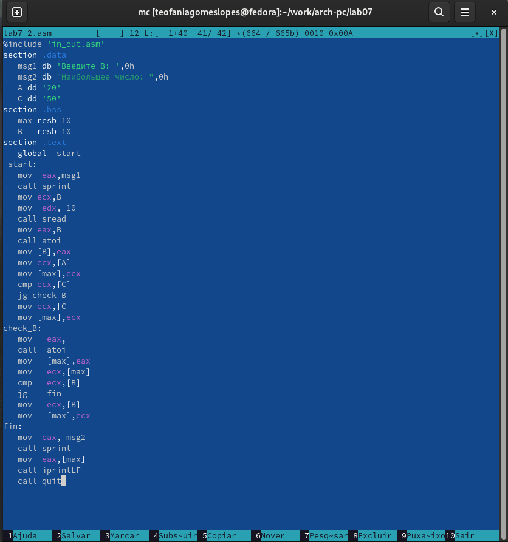{#fig:013 width=70%}

Транслировала с получением файла листинга (рис. [-@fig:014]).

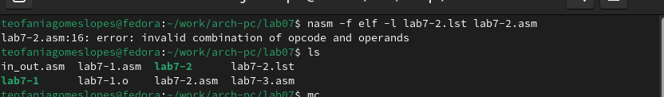{#fig:014 width=70%}

При трансляции файла, выдается ошибка, но создаются исполнительный файл lab7-2 и lab7-2.lst

Снова открывала файл листинга и изучала его (рис. [-@fig:015]).

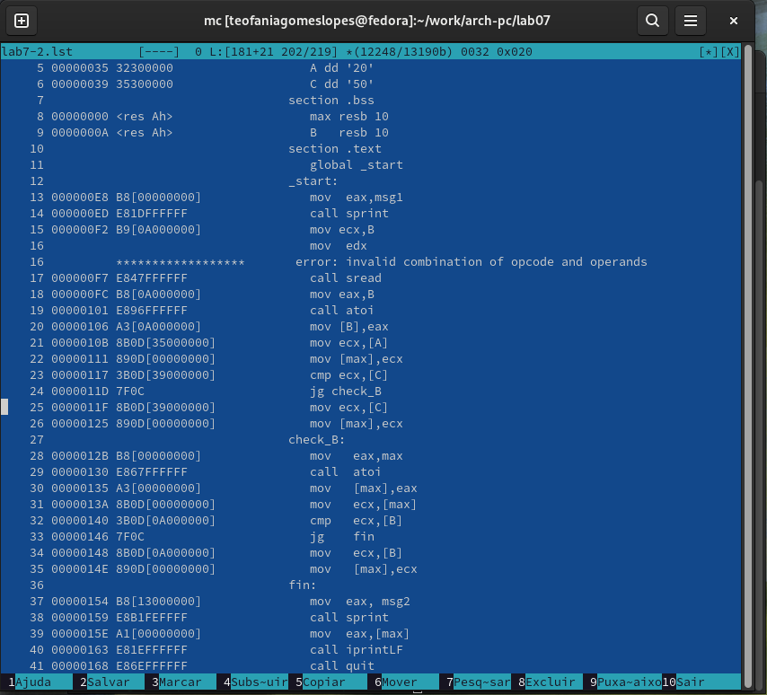{#fig:015 width=70%}

## Задание для самостоятельной работы

ВАРИАНТ-12

1. Напишите программу нахождения наименьшей из 3 целочисленных переменных 𝑎,𝑏 и с.Значения переменных выбрать из табл. 7.5 в соответствии с вариантом, полученнымпри выполнении лабораторной работы № 7. Создайте исполняемый файл и проверьте его работу.

Создала новый файл (рис. [-@fig:016]).

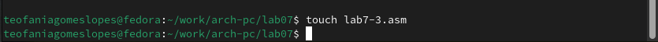{#fig:016 width=70%}

Открывала его и писала программу, которая выберет наименбшее число из трех(2 числа уже в программе, 3е вводится из консоли) (рис. [-@fig:017]).

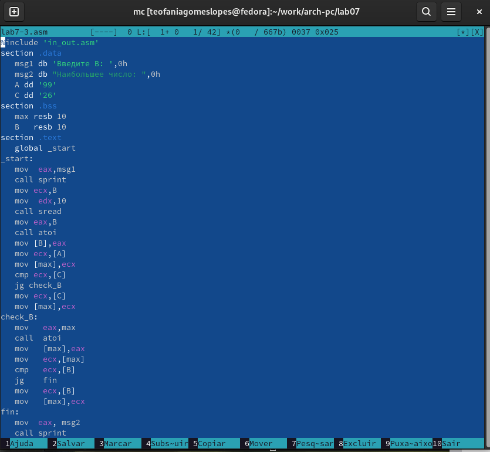{#fig:017 width=70%}

Транслирпвала файл и смотрила на работу программы (рис. [-@fig:018])

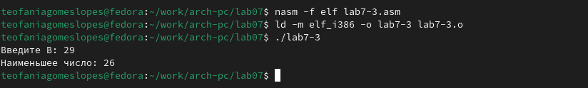{#fig:018 width=70%}

2. Напишите программу, которая для введенных с клавиатуры значений 𝑥 и 𝑎 вычисляет значение заданной функции 𝑓(𝑥) и выводит результат вычислений. Вид функции 𝑓(𝑥) выбрать из таблицы 7.6 вариантов заданий в соответствии с вариантом, полученным при выполнении лабораторной работы № 7. Создайте исполняемый файл и проверьте его работу для значений 𝑥 и 𝑎 из 7.6.

Создала новый файл (рис. [-@fig:019])

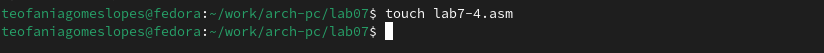{#fig:019 width=70%}

Открывала его и пишем программу, которая решит систему уравнений, при даных, введенных в консоль (рис. [-@fig:020])

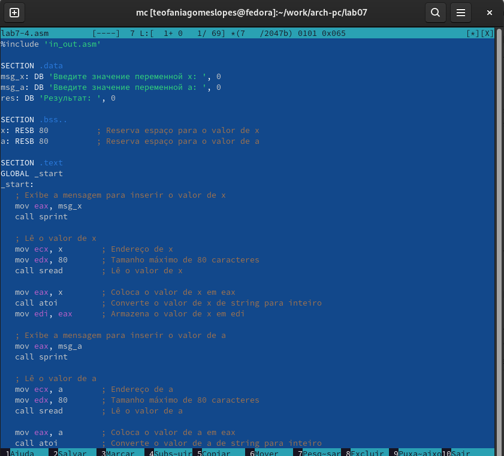{#fig:020 width=70%}

Транслировала файл и проверяла его работу (рис. [-@fig:021])

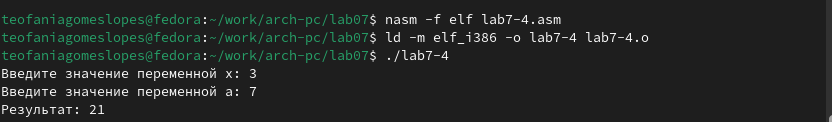{#fig:021 width=70%}

Транслировала файл и проверяем его работу (рис. [-@fig:022])

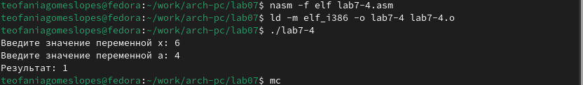{#fig:022 width=70%}

# Выводы

Я познакомилась с структурой файла листинга, изучили команды условного и безусловного перехоа.

# Список литературы{.unnumbered}

::: {#refs}
:::
