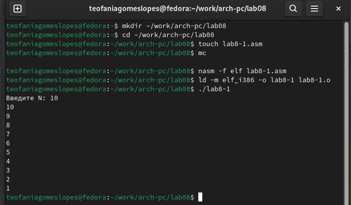

---
## Front matter
title: "Отчёта по лабораторной работе №8"
subtitle: "Программирование цикла. Обработка аргументов командной строки."
author: "Гомес Лопес Теофания"

## Generic otions
lang: ru-RU
toc-title: "Содержание"

## Bibliography
bibliography: bib/cite.bib
csl: pandoc/csl/gost-r-7-0-5-2008-numeric.csl

## Pdf output format
toc: true # Table of contents
toc-depth: 2
lof: true # List of figures
lot: true # List of tables
fontsize: 12pt
linestretch: 1.5
papersize: a4
documentclass: scrreprt
## I18n polyglossia
polyglossia-lang:
  name: russian
  options:
	- spelling=modern
	- babelshorthands=true
polyglossia-otherlangs:
  name: english
## I18n babel
babel-lang: russian
babel-otherlangs: english
## Fonts
mainfont: IBM Plex Serif
romanfont: IBM Plex Serif
sansfont: IBM Plex Sans
monofont: IBM Plex Mono
mathfont: STIX Two Math
mainfontoptions: Ligatures=Common,Ligatures=TeX,Scale=0.94
romanfontoptions: Ligatures=Common,Ligatures=TeX,Scale=0.94
sansfontoptions: Ligatures=Common,Ligatures=TeX,Scale=MatchLowercase,Scale=0.94
monofontoptions: Scale=MatchLowercase,Scale=0.94,FakeStretch=0.9
mathfontoptions:
## Biblatex
biblatex: true
biblio-style: "gost-numeric"
biblatexoptions:
  - parentracker=true
  - backend=biber
  - hyperref=auto
  - language=auto
  - autolang=other*
  - citestyle=gost-numeric
## Pandoc-crossref LaTeX customization
figureTitle: "Рис."
tableTitle: "Таблица"
listingTitle: "Листинг"
lofTitle: "Список иллюстраций"
lotTitle: "Список таблиц"
lolTitle: "Листинги"
## Misc options
indent: true
header-includes:
  - \usepackage{indentfirst}
  - \usepackage{float} # keep figures where there are in the text
  - \floatplacement{figure}{H} # keep figures where there are in the text
---

# Цель работы

Изучить работу циклов и обработкой аргументов командной строки.

# Задание

Написать программы с использованием циклов и обработкой аргументов командной строки.

# Выполнение лабораторной работы

## Реализация циклов в NASM

Создала каталог для программ ЛБ8, и в нем создала файл (рис. [-@fig:001]).

{#fig:001 width=70%}

Открывала файл в Midnight Commander и заполняла его в соответствии с листингом 8.1 (рис. [-@fig:002]).

{#fig:002 width=70%}

Создала исполняемый файл и запускала его (рис. [-@fig:003]).

{#fig:003 width=70%}

Снова открывала файл для редактирования и изменяла его, добавив изменение значения регистра в цикле (рис. [-@fig:004]).

{#fig:004 width=70%}

Создала исполняемый файл и запускала его (рис. [-@fig:005]).

{#fig:005 width=70%}

Регистр ecx принимает значения 9,7,5,3,1(на вход подается число 10, в цикле label данный регистр уменьшается на 2 командой sub и loop).

Число проходов цикла не соответсвует числу N, так как уменьшается на 2.

Снова открывала файл для редактирования и изменяла его, чтобы все корректно работало (рис. [-@fig:006]).

{#fig:006 width=70%}

Создала исполняемый файл и запускада его (рис. [-@fig:007]).

{#fig:007 width=70%}

В данном случае число проходов цикла равна числу N.

## Обработка аргументов командной строки.

Создала новый файл (рис. [-@fig:008]).

{#fig:008 width=70%}

Открывала файл в Midnight Commander и заполняла его в соответствии с листингом 8.2 (рис. [-@fig:009]).

{#fig:009 width=70%}

Создала исполняемый файл и проверяла его работу, указав аргументы (рис. [-@fig:010])

{#fig:010 width=70%}

Програмой было обработано 3 аргумента.

Создала новый файл lab8-3.asm (рис. [-@fig:011])

{#fig:011 width=70%}

Открывала файл и заполняла его в соответствии с листингом 8.3 (рис. [-@fig:012])

{#fig:012 width=70%}

Создала исполняемый файл и запускала его, указав аргументы (рис. [-@fig:013])

{#fig:013 width=70%}

Снова открывала файл для редактирования и изменяла его, чтобы вычислялось произведение вводимых значений (рис. [-@fig:014])

{#fig:014 width=70%}

Создала исполняемый файл и запускала его, указав аргументы (рис. [-@fig:015])

{#fig:015 width=70%}

## Задание для самостоятельной работы

ВАРИАНТ-12

Создала новый файл (рис. [-@fig:016])

{#fig:016 width=70%}

Открывала его и пишем программу, которая выведет сумму значений, получившихся после решения выражения 15x-9 (рис. [-@fig:017])

{#fig:017 width=70%}

Транслировала файл и смотрила на работу программы (рис. [-@fig:018])

{#fig:018 width=70%}

Транслировала файл и смотрела на работу программы (рис. [-@fig:019])

{#fig:019 width=70%}

# Выводы

Мы научились решать программы с использованием циклов и обработкой аргументов командной строки.

# Список литературы{.unnumbered}

::: {#refs}
:::
